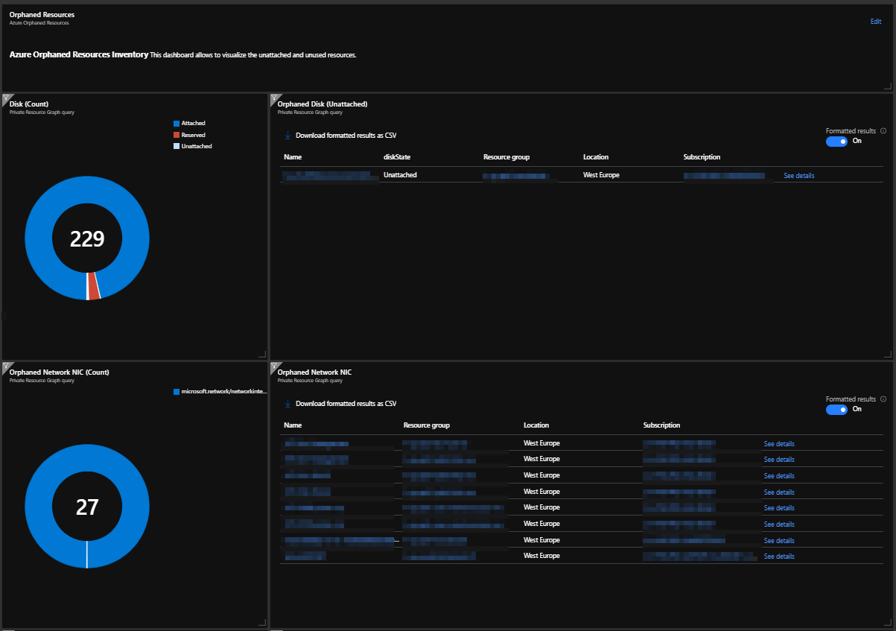

# KQL Queries for Azure Orphaned Resources

## Find Orphaned Disks
```
Resources
| where type has "microsoft.compute/disks"
| extend diskState = tostring(properties.diskState)
| where managedBy == "" or diskState == 'Unattached'
| project id, diskState, resourceGroup, location, subscriptionId
```
```
Resources
| where type =~ 'Microsoft.Compute/disks'
| where properties.diskState =~ 'Unattached'
| project-away tenantId, kind, managedBy, sku, plan, tags, identity, zones, extendedLocation, properties
```

## Find Orphaned NICs
```
Resources
| where type has "microsoft.network/networkinterfaces"
| where "{nicWithPrivateEndpoints}" !has id
| where properties !has 'virtualmachine'
| project id, resourceGroup, location, subscriptionId
```
To exclude private endpoints added : 
```
| where name !has '.nic' and name !has 'pvendpt_name_according_to_the_name_of_the_resource' 
```

## Find Orphaned NSG (no nic or subnet)
```
Resources
| where type =~ 'microsoft.network/networksecuritygroups' and isnull(properties.networkInterfaces) and isnull(properties.subnets)
| project Resource=id, resourceGroup, subscriptionId, location
```

## Find Orphaned Public IP
```
resources 
| where type =~ 'microsoft.network/publicipaddresses' 
| extend IpConfig = properties.ipConfiguration.id 
| where isempty(IpConfig)
```

## Find Orphaned Availability Sets
```
resources
| where type =~ 'microsoft.compute/availabilitysets'
| extend VirtualMachines = array_length(properties.virtualMachines)
| where VirtualMachines == 0
```

## Find Deallocated Virtual Machines
```
Resources
| project name, location, resourceGroup, subscriptionId, PowerState=tostring(properties.extended.instanceView.powerState.code), type
| where type =~ 'Microsoft.Compute/virtualMachines'
| where PowerState == "PowerState/deallocated"
| order by name desc
```

## Azure Dashboard

You will find in this [repo](./azure-dashboard/azure-orphaned-resources.json) a **.json** file for creating an Azure dashboard that looks like :


